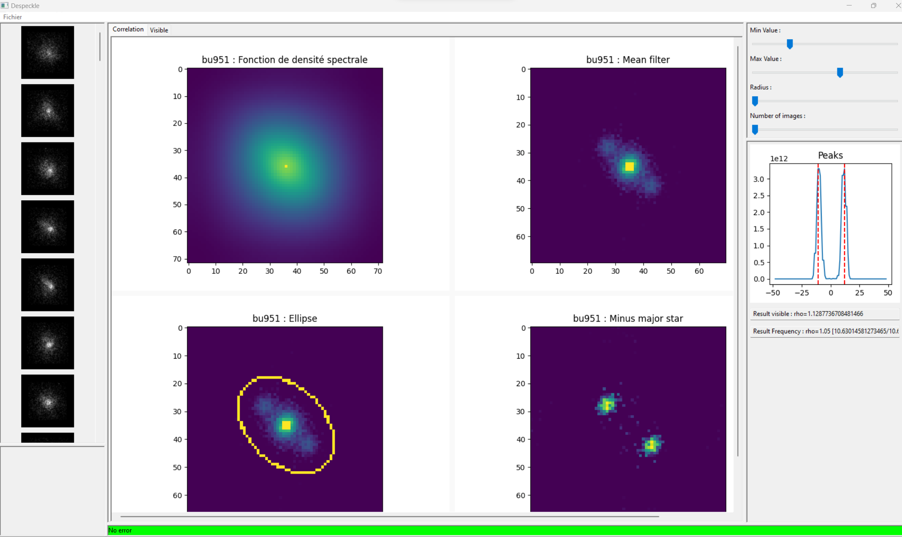

# binary_star_resolver
Find binary star parameters with speckle interferometry processing

Use wx to create windows program to implement algorithm described in this project : 
https://github.com/air01a/speckles-interferometry

 